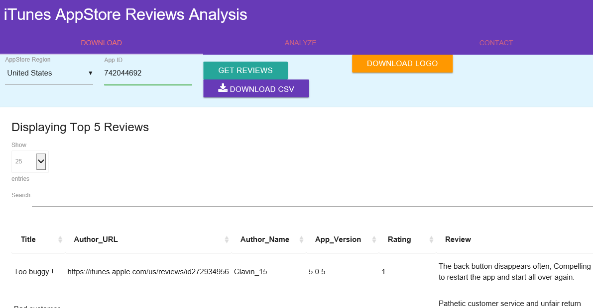
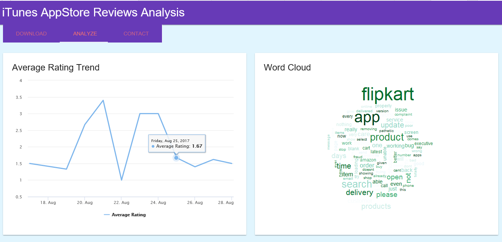
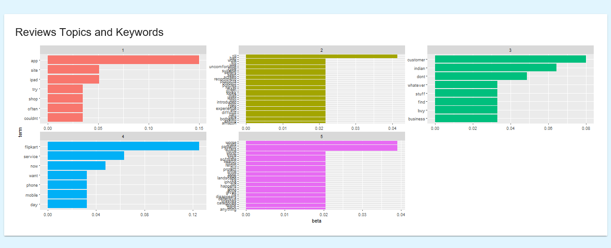

# itunesr_webapp
WebApp in RShiny using the package itunesr for iTunes AppStore Review Extraction and Analysis

## How to Run this:

**Method 1**

* Download/Clone the repo in your local machine
* Open *App.R* in your Rstudio 
* Install requried packages and click Run button (on the top-right above editor) 

**Method 2**

* Install required packages in your Rstudio and execute `runGitHub('amrrs/itunesr_webapp)` in your console 

Note: Please make sure your computer is connected to Internet and not behind any Firewall.

First Tab:

Second Tab:

